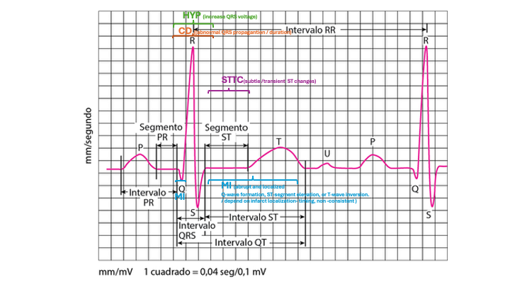

# ECG Anomaly Detection with Autoencoders

This repository contains a notebook exploring the use of Autoencoders trained on normal segmented ECGs for anomaly detection.

---

## Data Description

- **Data Source:**  
  12-lead recordings from the PTB Diagnostic ECG Database via PhysioNet.

- **Reference:**  
  Wagner, P., Strodthoff, N., Bousseljot, R., Samek, W., & Schaeffter, T. (2022). PTB-XL, a large publicly available electrocardiography dataset (version 1.0.3). PhysioNet. RRID:SCR_007345.  
  [https://doi.org/10.13026/kfzx-aw45](https://doi.org/10.13026/kfzx-aw45)

- **Data Access:**  
  Data was loaded directly from [the PTB-XL PhysioNet web page](https://physionet.org/content/ptb-xl/1.0.3/).

### Files Used

- `records100/` — Contains waveform ECG data sampled at 100 Hz.
- `scp_statements.csv` — Annotation scheme information.
- `ptbxl_database.csv` — Main metadata file, with one row per record identified by `ecg_id`.

#### Metadata Structure

- **Identifiers** — `ecg_id`, `patient_id`, file paths for 500 Hz (`filename_hr`) and 100 Hz (`filename_lr`) signals.
- **General Metadata** — Demographic and recording details like age, sex, device, etc.
- **ECG Statements** — Includes `scp_codes` (SCP-ECG statements), `report`, and additional clinical annotations.
- **Signal Metadata** — Quality measures (noise, drift, artifacts, extra beats, pacemaker).
- **Cross-validation Folds** — Recommended 10-fold train-test splits, preserving patient assignments.  
  - _Folds 1-8:_ Training set  
  - _Fold 9:_ Validation set  
  - _Fold 10:_ Test set (high label quality)

---

## Data Download Instructions

**Note:**  
Due to size constraints (original data files >3GB), ECG waveform data is **not included** in this repository.

To download the data for local use, run:

```sh
wget -r -N -c -np https://physionet.org/files/ptb-xl/1.0.3/
```

Alternatively, visit [PhysioNet PTB-XL data page](https://physionet.org/content/ptb-xl/1.0.3/) to download required files manually.

**Required files:**
- `records100/`  — ECG waveform data (100Hz)
- `scp_statements.csv` — Annotation schema
- `ptbxl_database.csv` — Metadata

Please **do not upload these files to GitHub** when working with this repository.

---

## ECG Labels and Interpretations: 

| Label    | Meaning                | Notes / Typical ECG Findings                                                                                                              |
| -------- | ---------------------- | ----------------------------------------------------------------------------------------------------------------------------------------- |
| **NORM** | Normal                 | No significant abnormalities. Standard sinus rhythm.                                                                                      |
| **MI**   | Myocardial Infarction  | Signs of past or acute heart attack; may show Q waves, ST-T changes.                                                                      |
| **HYP**  | Hypertrophy            | Usually left or right ventricular hypertrophy; high voltage QRS, strain patterns.                                                         |
| **CD**   | Conduction Disturbance | Includes bundle branch blocks, AV blocks, abnormal QRS propagation.                                                                       |
| **STTC** | ST-T Changes           | Repolarization abnormalities: ST elevation/depression, T wave inversion or flattening; can indicate ischemia or electrolyte disturbances. |

## Schematic of an Individual Heartbeat

 Highlighted regions indicate areas typically affected by each pathology in the dataset.
 


---

## Local Set Up to Run on VS Code

1. **Create Environment:**  
   Set up your Python environment for Jupyter Notebook.
2. **Install Required Dependencies:**  
   Use the provided `requirements.txt` file to install all the necessary Python libraries:

   ```sh
   pip install -r requirements.txt
   ```
   <br>
   This will install:

   - wfdb
   - iterative-stratification
   - scikit-multilearn
   - torch, torchvision, torchaudio
   - transformers
   - scipy, tqdm, mlflow, optuna
   - pandas, numpy, scikit-learn
   - matplotlib, seaborn, plotly
   - neurokit2

   _**Note:** You must use **Python 3.10.3 or newer**._
   
4. **VS Code Configuration:**  
   Configure your VS Code environment to work with Jupyter Notebooks.

---

## Getting Started

- Clone this repository:
  ```sh
  git clone https://github.com/paulavazq/ecg-anomaly-detection-autoencoders.git
  ```
- Set up environment and install requirements.
- Open `ECG_Anomaly_Detection_Autoencoders.ipynb` in VS Code or JupyterLab.
  
- **Important:**  
After downloading the PTB-XL dataset files to your local machine, you must ensure that your code (and notebook) points to the correct local file paths for:
- `records100/`
- `scp_statements.csv`
- `ptbxl_database.csv`

Modify the data loading sections to use the location **where you stored the downloaded files**. For example:
```python
base_path = "/your/local/path/ptb-xl-1.0.3/"
```
Replace with your actual download path if needed.

---

## License

See the [LICENSE](./LICENSE) file for licensing details.

---

### Note on Version Control

Large data files (such as `records100/`, `.csv`, `.h5`, and notebook checkpoints) are **excluded from version control** using the `.gitignore` file.  
This prevents accidental uploads of big files and unnecessary clutter in the repository.

If you add other large files to your project, update `.gitignore` accordingly!
# Ignore macOS Finder file
.DS_Store

# Ignore (large) data files not meant for repo
*.csv
*.h5
*.npz
records100/
```
